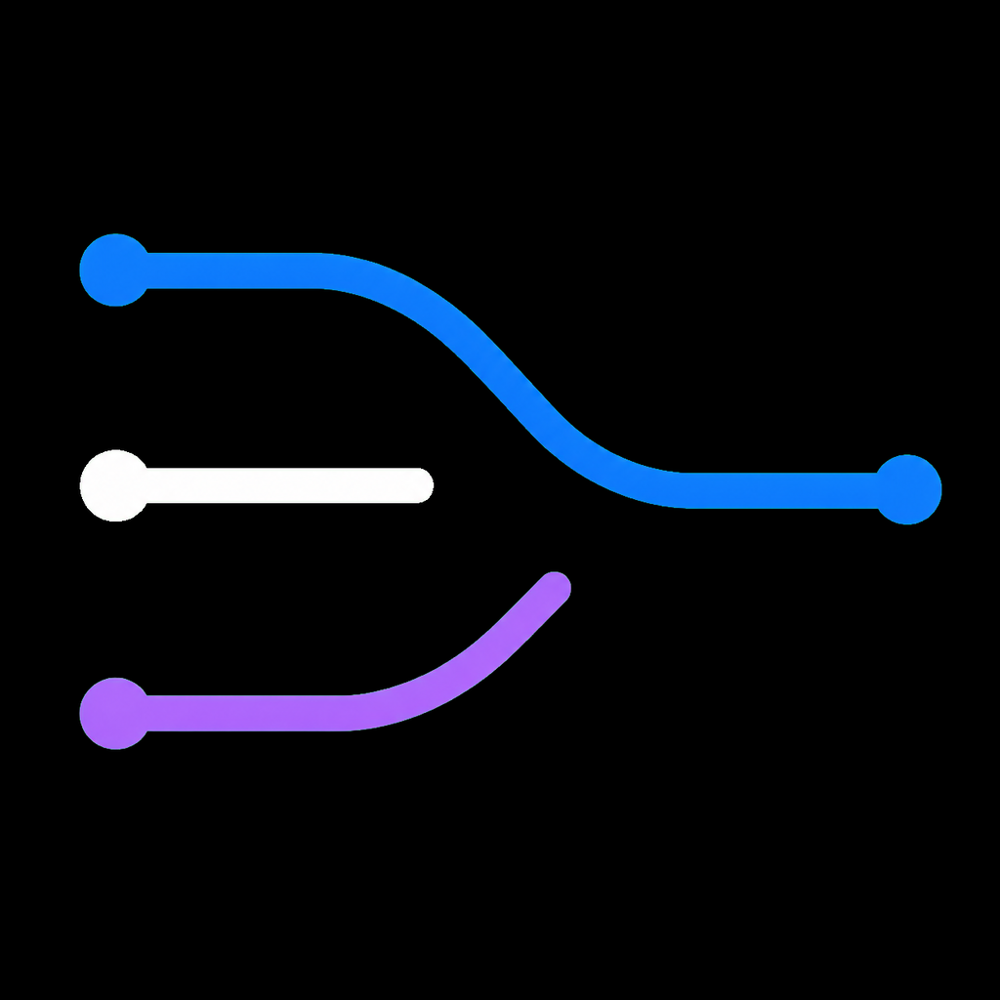
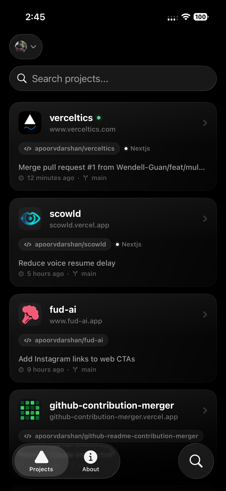
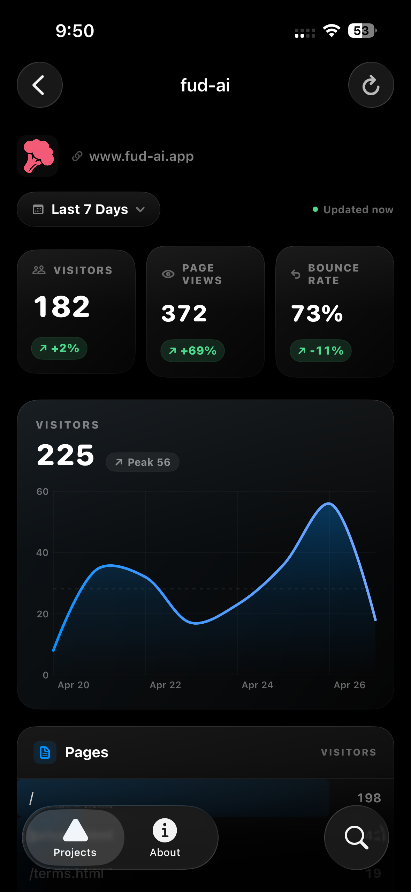
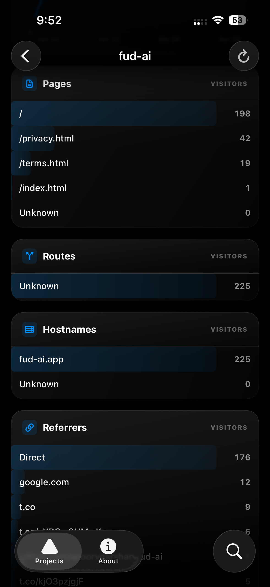
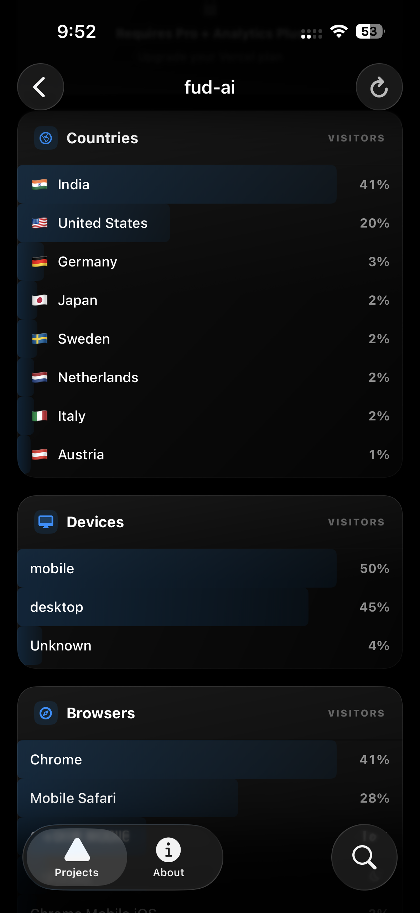
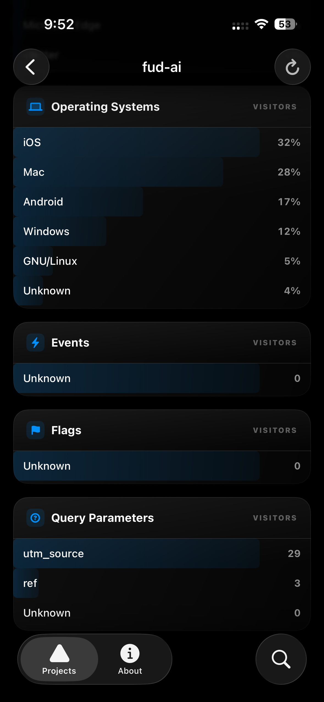

<p align="center">
  
</p>

<h1 align="center">Verceltics</h1>

<p align="center">
  Vercel Web Analytics on your iPhone.<br>
  <a href="https://apps.apple.com/us/app/verceltics/id6761645656">App Store</a> · <a href="https://verceltics.site">Website</a>
</p>

<p align="center">
  <a href="LICENSE"></a>
  <a href="https://swift.org"></a>
  <a href="https://developer.apple.com/ios/"></a>
</p>

## Screenshots

| Projects | Analytics |
|:---:|:---:|
|  |  |
| All your Vercel projects with favicons, git repo, and last commit | Visitors, page views, bounce rate with interactive chart |

| Pages & Routes | Referrers & Countries | Devices & Browsers |
|:---:|:---:|:---:|
|  |  |  |
| Pages, routes, and hostnames with visitor counts | Referrers, UTM parameters, and countries with flags | Device types, browsers, and operating systems |

## Features

- **Projects Dashboard** — All your Vercel projects with favicons, git repo, last commit, framework
- **Analytics** — Visitors, page views, bounce rate with % change badges
- **Interactive Chart** — Drag to inspect data points, daily aggregation for smooth curves
- **Full Breakdowns** — Pages, routes, hostnames, referrers, UTM, countries, devices, browsers, OS, events, flags, query params
- **Search** — Filter projects by name, domain, or framework
- **Pull to Refresh** — Live data from Vercel API
- **Dark Mode** — Pure black (#000000) Vercel-style design
- **Secure** — Token stored in iOS Keychain, open source code

## Tech Stack

- **SwiftUI** — Entire UI
- **Swift Charts** — Interactive line chart
- **StoreKit 2** — Subscriptions ($3.99/mo, $29.99/yr, 3-day trial)
- **Keychain** — Secure token storage
- **async/await** — All API calls
- **Zero dependencies** — No third-party libraries

## Repository Structure

This is a monorepo containing both the iOS app and the landing page:

```
verceltics/
├── ios/          # SwiftUI iOS app
└── web/          # Next.js landing page (verceltics.site)
```

## Setup (iOS)

1. Clone the repo
   ```bash
   git clone https://github.com/apoorvdarshan/verceltics.git
   ```
2. Open `ios/verceltics.xcodeproj` in Xcode
3. Select your team in Signing & Capabilities
4. Build and run (iOS 18.0+)

## Setup (Web)

```bash
cd web
npm install
npm run dev
```

### Vercel Token

The app uses a [Vercel personal access token](https://vercel.com/account/tokens) for authentication:

1. Go to [vercel.com/account/tokens](https://vercel.com/account/tokens)
2. Create a token with your account scope
3. Paste it in the app

### StoreKit Testing

To test the paywall in Xcode:

1. Edit Scheme → Run → Options → StoreKit Configuration → select `Products.storekit`
2. Build and run
3. Use Debug → StoreKit → Manage Transactions to reset purchases

## API

The app uses two Vercel API hosts:

| Host | Endpoints | Auth |
|------|-----------|------|
| `api.vercel.com` | `/v9/projects` | Bearer token |
| `vercel.com/api` | `/web-analytics/*` | Bearer token |

Analytics endpoints use `groupBy` parameter: `path`, `route`, `hostname`, `referrer`, `utm`, `country`, `device_type`, `client_name`, `os_name`, `event_name`, `flags`, `query_params`

## iOS Project Structure

```
ios/verceltics/
├── App/VercelticsApp.swift          # Entry point, auth + paywall routing
├── Auth/
│   ├── AuthManager.swift            # Token validation, login/logout
│   └── KeychainHelper.swift         # Secure token storage
├── Network/VercelAPI.swift          # All API calls (actor-based)
├── Models/
│   ├── Project.swift                # Project, deployment, alias models
│   └── Analytics.swift              # Analytics data models, time ranges
├── Views/
│   ├── LoginView.swift              # Token login with animated demo chart
│   ├── MainTabView.swift            # Tab bar (Projects, About, Search)
│   ├── ProjectsView.swift           # Project list with favicon loading
│   ├── AnalyticsView.swift          # Full analytics dashboard
│   └── AboutView.swift              # Settings, links, legal, sign out
├── Components/
│   ├── StatCard.swift               # Metric card with change badge
│   └── AnalyticsChart.swift         # Interactive Swift Charts line graph
└── Paywall/
    ├── PaywallManager.swift         # StoreKit 2 purchase logic
    ├── PaywallView.swift            # Subscription paywall UI
    └── Products.storekit            # StoreKit testing config
```

## Disclaimer

Verceltics is **not** affiliated with, endorsed by, or sponsored by Vercel Inc. Vercel and the Vercel logo are trademarks of Vercel Inc. This is an independent, open-source project that uses Vercel's API with user-provided authentication tokens.

## Contributing

See [CONTRIBUTING.md](CONTRIBUTING.md) for guidelines.

## License

[MIT](LICENSE)

## Contact

- **Email**: ad13dtu@gmail.com
- **X**: [@apoorvdarshan](https://x.com/apoorvdarshan)
- **Issues**: [github.com/apoorvdarshan/verceltics/issues](https://github.com/apoorvdarshan/verceltics/issues)
