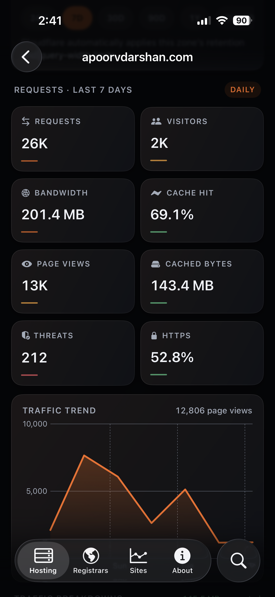
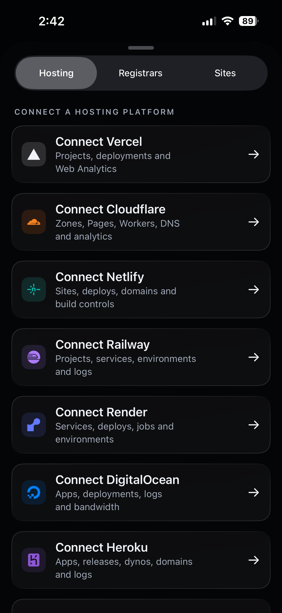
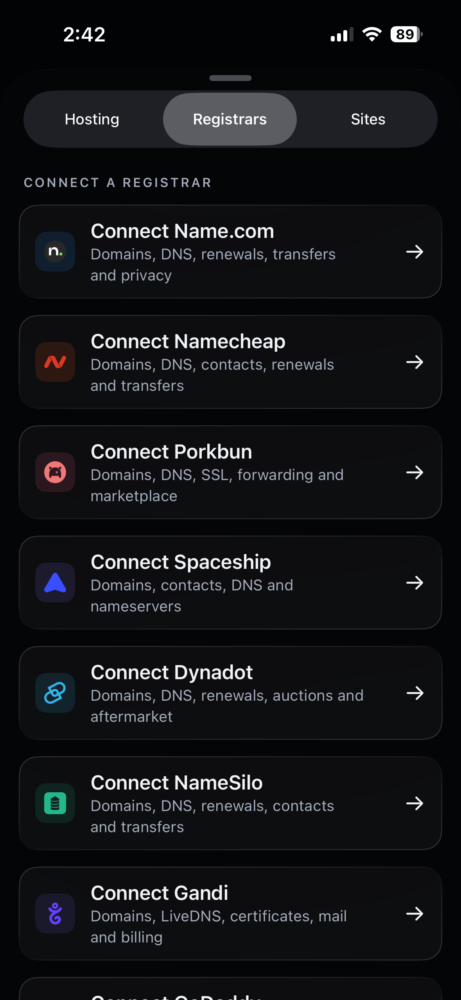
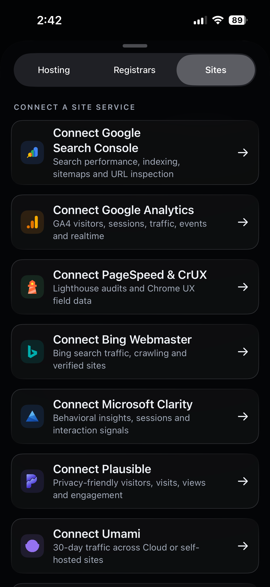

<p align="center">
  
</p>

<h1 align="center">Verceltics</h1>

<p align="center">
  Hosting, domains, deployments, analytics, search, speed, and uptime<br>
  in one private iPhone and iPad workspace.
</p>

<p align="center">
  <a href="https://apps.apple.com/us/app/verceltics/id6761645656">App Store</a> ·
  <a href="https://verceltics.com">Website</a> ·
  <a href="https://verceltics.com/privacy">Privacy</a> ·
  <a href="https://verceltics.com/terms">Terms</a>
</p>

<p align="center">
  <a href="https://github.com/apoorvdarshan/verceltics/releases/latest"></a>
  <a href="LICENSE"></a>
  <a href="https://swift.org"></a>
  <a href="https://developer.apple.com/ios/"></a>
  <a href="https://github.com/apoorvdarshan/verceltics/stargazers"></a>
</p>

Verceltics is an independent, open-source operator workspace for the infrastructure and site services developers already use. Each provider keeps its own dashboard and capabilities; Verceltics supplies the native navigation, secure local credential storage, responsive caching, and iPhone/iPad interface around them. The `main` branch documents the current source build and can be ahead of the latest App Store release.

## Screenshots

The README highlights the iPhone experience. Verceltics also has a fully adaptive iPad interface; visit the [website](https://verceltics.com) for the complete iPad gallery.

<table>
  <tr>
    <td align="center"><br><strong>Traffic analytics</strong><br><sub>Requests, visitors, bandwidth, cache, threats, HTTPS, and trend</sub></td>
    <td align="center"><br><strong>10 hosting platforms</strong><br><sub>Projects, deployments, domains, DNS, logs, storage, and provider operations</sub><br><sub>Vercel · Cloudflare · Netlify · Railway · Render · DigitalOcean · Heroku · Fly.io · Firebase Hosting · AWS Amplify</sub></td>
  </tr>
  <tr>
    <td align="center"><br><strong>8 domain registrars</strong><br><sub>Domains, DNS, renewals, transfers, contacts, certificates, and privacy</sub><br><sub>Name.com · Namecheap · Porkbun · Spaceship · Dynadot · NameSilo · Gandi · GoDaddy</sub></td>
    <td align="center"><br><strong>9 site services</strong><br><sub>Search, analytics, performance, behavioral insights, and uptime</sub><br><sub>Google Search Console · Google Analytics · PageSpeed &amp; CrUX · Bing Webmaster · Microsoft Clarity · Plausible · Umami · UptimeRobot · Better Stack</sub></td>
  </tr>
</table>

## Supported providers

Verceltics 2.0 includes 27 separate integrations: 10 hosting platforms, 8 registrars, and 9 site services. Providers stay separated by the job they perform; Google Search Console and Google Analytics, for example, are independent connections and dashboards inside the Sites workspace. Available data and operations vary with each provider API, credential scope, account plan, and enabled service.

### Hosting — 10

- Vercel
- Cloudflare
- Netlify
- Railway
- Render
- DigitalOcean
- Heroku
- Fly.io
- Firebase Hosting
- AWS Amplify

### Registrars — 8

- Name.com
- Namecheap
- Porkbun
- Spaceship
- Dynadot
- NameSilo
- Gandi
- GoDaddy

### Site services — 9

- Google Search Console
- Google Analytics
- PageSpeed & CrUX
- Bing Webmaster
- Microsoft Clarity
- Plausible
- Umami
- UptimeRobot
- Better Stack

## What the app does

- **Native workspaces** — Hosting, Registrars, and Sites remain separate, with provider-aware dashboards and account menus.
- **Cloudflare control** — Accounts, zones, DNS CRUD, analytics, Pages, Workers, storage, security, cache, and guarded advanced API operations.
- **Hosting dashboards** — Projects, services, deployments, environments, domains, logs, jobs, bandwidth, channels, releases, and provider operation catalogs where supported.
- **Registrar dashboards** — Domains, expiry and renewal state, nameservers, DNS, contacts, transfers, privacy, certificates, and provider operation catalogs where supported.
- **Separate site dashboards** — Search Console, Google Analytics, PageSpeed, Bing, Clarity, Plausible, Umami, UptimeRobot, and Better Stack each open independently.
- **Deep provider data** — Search performance, indexing, sitemaps, URL inspection, GA4 reporting, Lighthouse and CrUX, uptime, response time, and availability.
- **Responsive caching** — Sites can reopen from protected, backup-excluded local snapshots; other recently viewed dashboards use in-memory cache. Data refreshes when the app becomes active, and pull to refresh remains available.
- **iPad layout** — Sidebar-adaptable navigation, adaptive grids, wider detail surfaces, and full-width charts on regular size class.
- **Appearance** — System, light, and dark modes.
- **Guarded operations** — Cross-host redirects are blocked; detected writes, purchases, and destructive requests require confirmation.
- **Open source** — The complete SwiftUI app and Next.js website are available in this repository.

## Privacy architecture

Provider credentials and Google OAuth tokens are stored with device-only, when-unlocked iOS Keychain protection. Provider-data requests go directly from the app to provider HTTPS APIs or an explicitly selected HTTPS host for supported self-hosted services.

```text
iPhone / iPad
  ├─ device-only iOS Keychain
  ├─ protected, backup-excluded local snapshots
  ├─ HTTPS ───────────────────────────────> selected provider API
  └─ credential-free public IPv4 lookup ─> api.ipify.org (registrar setup only)

No Verceltics credential proxy or provider-data server sits in between.
```

- No app tracking or advertising SDK
- No provider-data telemetry
- No third-party favicon service; favicon checks stay on the project site's own HTTPS origin
- Registrar setup can request the device network's public IPv4 from ipify without credentials or provider data; Namecheap uses the accepted address as required connection metadata
- Google API data is used only for the connected user-facing feature and handled under Google's Limited Use requirements
- The website has no client-side analytics and is delivered through Cloudflare Workers Static Assets

Read the complete [Privacy Policy](https://verceltics.com/privacy) and [Security Policy](SECURITY.md).

## Pricing

| Plan | Price | Trial |
|---|---:|---|
| Monthly | $4.99/month | None |
| Yearly | $34.99/year | 7 days for eligible first-time subscribers |
| Lifetime | $59.99 once | Not applicable |

All paid options unlock the same Verceltics Pro entitlement. App Store pricing can vary by country, currency, and tax. The source is MIT-licensed and may be built or modified for personal use; personal builds require their own provider credentials and any OAuth configuration needed by the selected Google integrations.

## Tech stack

### iOS

- SwiftUI with sidebar-adaptable `TabView`
- Swift Charts for native, interactive analytics
- Swift 5 language mode with main-actor default isolation and structured concurrency
- Observation (`@Observable`) and `async`/`await`
- iOS Keychain for device-only credential storage
- RevenueCat + StoreKit for subscriptions, lifetime access, optional tips, and restoration

### Web

- Next.js App Router with static export
- React and TypeScript
- Tailwind CSS v4 plus a custom app-matched design system
- Cloudflare Workers Static Assets via Wrangler

## Repository structure

```text
verceltics/
├── ios/                     # SwiftUI iPhone and iPad app
├── web/                     # Next.js website, privacy, and terms
├── docs/screenshots/ios/    # Current iPhone screenshots used by this README
├── docs/screenshots/ipad/   # Current iPad screenshot source assets
├── scripts/                 # Provider catalog generation and updates
└── tests/                   # Catalog and request-integrity tests
```

## Run the iOS app

1. Clone the repository.

   ```bash
   git clone https://github.com/apoorvdarshan/verceltics.git
   cd verceltics
   ```

2. Open `ios/verceltics.xcodeproj` in Xcode.
3. Select your Apple development team in Signing & Capabilities.
4. Choose an iPhone running iOS 18 or later, or an iPad running iPadOS 18 or later.
5. Build and run.

Production App Store entitlements are managed by Apple and RevenueCat. A source build still needs your own provider credentials and any OAuth configuration required by the Google integrations you intend to test.

## Run the website

```bash
cd web
npm install
npm run dev
```

Open [http://localhost:3000](http://localhost:3000).

Create the production static export:

```bash
npm run build
```

Deploy the exported `web/out` directory through the configured Cloudflare Workers Static Assets project:

```bash
npm run deploy
```

## Authentication model

| Category | Authentication |
|---|---|
| Vercel | Personal access token |
| Cloudflare | Scoped API token, or email + Global API Key |
| Other hosting providers | Provider token/key; Firebase Hosting uses Google OAuth |
| Registrars | Provider API key/token and any provider-required account metadata |
| Google Search Console / Analytics | Google OAuth with the documented read-only scopes |
| Other site services | Provider API key/token or user-selected HTTPS host where supported |

The app validates and scopes credential use to known provider hosts. Advanced operation catalogs expose provider-relative APIs; review every write request before confirmation.

## Testing

Run repository tests:

```bash
./scripts/test.sh
```

For purchase testing, use Apple sandbox or TestFlight together with RevenueCat customer history and entitlement tools. The checked-in StoreKit configuration mirrors the monthly, yearly, lifetime, and optional-tip products for local reference.

## Disclaimer

Verceltics is not affiliated with, endorsed by, or sponsored by any supported hosting platform, registrar, or site-intelligence service. Provider names and marks belong to their respective owners.

## Contributing

See [CONTRIBUTING.md](CONTRIBUTING.md) before opening a pull request. Report security issues privately using [SECURITY.md](SECURITY.md).

## License

[MIT](LICENSE)

## Contact

- Email: [ad13dtu@gmail.com](mailto:ad13dtu@gmail.com)
- X: [@apoorvdarshan](https://x.com/apoorvdarshan)
- LinkedIn: [Verceltics](https://www.linkedin.com/company/verceltics)
- Support: [ko-fi.com/apoorvdarshan](https://ko-fi.com/apoorvdarshan)
- Issues: [github.com/apoorvdarshan/verceltics/issues](https://github.com/apoorvdarshan/verceltics/issues)

## Contributors

<a href="https://github.com/apoorvdarshan/verceltics/graphs/contributors">
  
</a>

## Star History

<a href="https://www.star-history.com/?repos=apoorvdarshan%2Fverceltics&type=date&legend=top-left">
 <picture>
   <source media="(prefers-color-scheme: dark)" srcset="https://api.star-history.com/chart?repos=apoorvdarshan/verceltics&type=date&theme=dark&legend=top-left&sealed_token=DwXYLjTue4rdo7cn1p8qwQo08vbXrdJjAzQvLP7dCR8FmYlWU0xbnYxZcceEqenzxHmWVnYukXgzUdhFozwZFiF01DWMu9Kbr8HOGhfTHo7dXTsB-WAI8b2tdKMQf5U-1nMjuCkavC3ySKBymks0EbOxCt2chNurnGGIgvHMuOG4-2tLTy5Duq7rqc_y" />
   <source media="(prefers-color-scheme: light)" srcset="https://api.star-history.com/chart?repos=apoorvdarshan/verceltics&type=date&legend=top-left&sealed_token=DwXYLjTue4rdo7cn1p8qwQo08vbXrdJjAzQvLP7dCR8FmYlWU0xbnYxZcceEqenzxHmWVnYukXgzUdhFozwZFiF01DWMu9Kbr8HOGhfTHo7dXTsB-WAI8b2tdKMQf5U-1nMjuCkavC3ySKBymks0EbOxCt2chNurnGGIgvHMuOG4-2tLTy5Duq7rqc_y" />
   
 </picture>
</a>

---

<p align="center">Built with care by <a href="https://x.com/apoorvdarshan">Apoorv Darshan</a>.</p>
