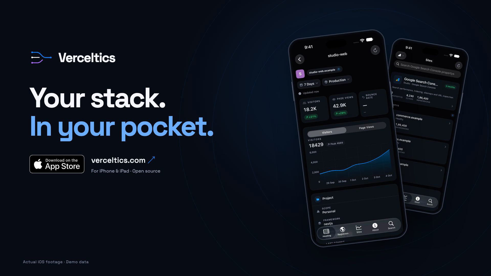

# Verceltics landscape promo

A 36-second, 1920 × 1080, 30 fps launch film for Product Hunt, X, and YouTube.
One landscape composition: `VercelticsLandscape`.

[Download the MP4](Verceltics-Landscape.mp4)



The film uses actual iOS Simulator recordings with fictional projects, domains,
and metrics. The footage comes from the isolated **iOS 2.1 preview** build and is labeled
“Actual iOS footage · Demo data.” No provider credentials or customer data
appear in the film.

## Render headlessly

```sh
cd marketing/video
npm ci
npx remotion browser ensure
npm run render:landscape
```

The H.264 MP4 is written to `Verceltics-Landscape.mp4`.
Rendering uses headless Chrome and does not open a preview browser.
`npm run studio` opens the editable timeline only when you want it.

## Storyboard

| Time | Scene |
| --- | --- |
| 0–3 s | Provider constellation and “Your entire stack. One pocket.” |
| 3–6 s | Animated Verceltics logo and name reveal |
| 6–12 s | Vercel recording, camera push, and magnified analytics crop |
| 12–18 s | Cloudflare recording in a contrasting camera setup |
| 18–24 s | Namecheap → Name.com, layered devices and provider marks |
| 24–30 s | Search Console → Google Analytics with site provider marks |
| 30–33 s | Twelve provider logos converge around the integration count |
| 33–36 s | Verceltics, App Store badge, website, and app screens |

## Motion direction

The original Simulator MP4 recordings are reused unchanged. The launch cut adds
frame-driven perspective, camera moves, masked typography, a vector logo draw,
provider choreography, and a magnified crop of the real Vercel recording.
The original soundtrack runs at 120 BPM, with accents on the main scene cuts.
No third-party launch footage, music, or stock UI is included in the export.

References researched for editing direction:

- [Raycast launch-film motion breakdown](https://impractical.ai/launch-videos/raycast-its-out):
  cuts on the beat, close framing, and kinetic typography.
- [Remotion prompt showcase](https://www.remotion.dev/prompts):
  launch and cinematic motion examples.

Provider marks come from this repository’s existing website and iOS assets.
The [official App Store badge](https://developer.apple.com/assets/elements/badges/download-on-the-app-store.svg)
was downloaded from Apple. The film’s graphics and soundtrack are original.


## Refresh the footage

Use the XcodeBuildMCP iOS debugger workflow to build and install the temporary
project on a dedicated Simulator. Preparation copies `ios/` to a new directory
outside the repository; it never edits the shipping project.

```sh
python3 capture/prepare-simulator.py /tmp/verceltics-marketing-ios-capture
```

Build the copied project with scheme `verceltics`, **Debug** configuration and
`CODE_SIGNING_ALLOWED=NO`. Reuse a stable DerivedData path, such as
`~/Library/Developer/Xcode/DerivedData/verceltics-marketing-simulator`.
The copy uses the separate bundle ID
`com.apoorvdarshan.verceltics.marketingdebug` and name **Verceltics Debug**.
Do not archive the temporary project or install it on a physical device.

```sh
python3 capture/record.py --simulator YOUR_SIMULATOR_UDID
```

The recorder launches only that separate Simulator app, suppresses the rating
prompt, sets a consistent status bar, and records native timed navigation.
Source MP4 clips and screenshots go in `public/footage/`; long raw recordings
stay outside the repository. Capture timings are recorded in
`capture/manifest.json`. Review new clips for startup frames before rendering.
`capture/edits.json` cuts the brief analytics loading wait from this capture;
review those time ranges when replacing the footage.
Dependencies: Xcode Simulator, Python 3, FFmpeg.

## Assets

- `public/logo.png`: the repository’s Verceltics logo.
- `public/footage/`: recordings of the real SwiftUI screens, using fictional
  fixtures from `capture/AppDebugFixtures.swift`.
- `public/launch-soundtrack.wav`: original instrumental soundtrack generated by
  `capture/make-soundtrack.py`; no third-party samples.
- `public/space-grotesk.woff2`: Space Grotesk, distributed under the SIL Open
  Font License in `public/FONT-LICENSE.txt`.

This marketing project does not change the shipping iOS or Android apps and
has no store release or publishing action.
